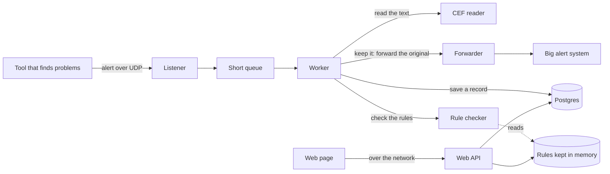

# How it works

The service does two things at the same time:

1. The **busy path** — catching alerts, deciding keep-or-drop, and forwarding the
   ones we keep.
2. The **control path** — a small web API that the web page uses to read numbers
   and change the rules.

## A picture

## The pieces

| Piece | Where | What it does |
|---|---|---|
| Listener | `backend/app/proxy/listener.py` | Catches the network messages and puts them on a short queue, so a slow step never blocks new messages. |
| CEF reader | `backend/app/cef` | Turns the alert text into fields. Never crashes on bad text. |
| Rule checker | `backend/app/rules/engine.py` | Goes through the rules top to bottom and stops at the first one that matches. |
| Rules store | `backend/app/rules/store.py` | Keeps the rules in memory for speed, and saves every change to the database. |
| Forwarder | `backend/app/proxy/forwarder.py` | Sends the kept alerts on, exactly as they arrived. |
| Database | `backend/app/db` | Postgres. Saves the rules, a history of every change, and a copy of each decision. |
| Web API | `backend/app/api` | The endpoints the web page calls. |

## Some choices, and why

- **Forward the exact original message.** The big alert system is picky about the
  text, so we pass the original through untouched and it always reads it.
- **Keep the rules in memory.** Reading the database for every single alert would
  be slow. The rules are loaded once and kept in memory; a change updates both the
  memory copy and the database.
- **Save decisions in the background.** Writing to the database happens on a side
  task, so it never slows the busy path. If too many pile up, the extra ones are
  counted and skipped instead of holding things up.
- **First match wins.** Rules are checked in order and the first match decides, so
  the outcome is easy to predict.

## What it cannot promise

UDP is fast but does not guarantee delivery, so a message can be lost on the way
in or out. The service counts what it can, but it cannot get back a lost message.

Live counts (received, kept, dropped) are kept in memory and reset when the
service restarts. The rules and the saved history live in Postgres and survive
restarts.

## Settings

All settings come from the environment — see
[`../backend/.env.example`](../backend/.env.example). The main ones: where to
listen, where to forward, the database address, the default keep-or-drop choice,
the secret token, and which web page address may connect.
